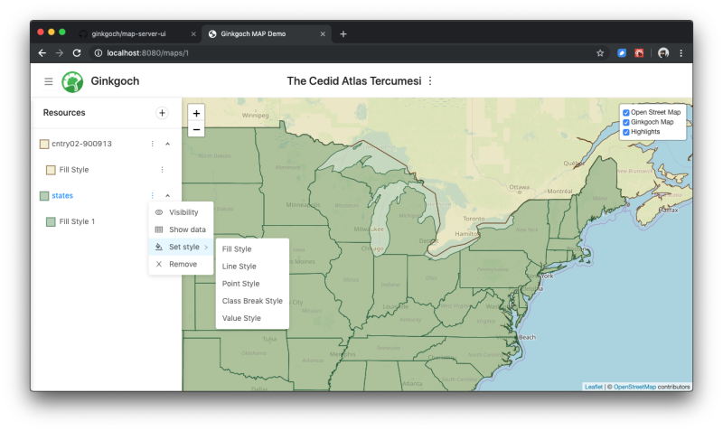

# UI for Ginkgoch MAP
This is the UI on browser for the self-hosted [map server project](https://github.com/ginkgoch/node-map-server). It is constructed with `node-map-server` as well as `Ginkgoch` other related toolkit. This is currently in development. Please feel free to contact [ginkgoch@outlook.com] for new feature requirements or retrieve more demos for my other components.

The goal of this project is to help user to build a beautify map without any programming skill. Once the map is ready, it allows to export the map to any other forms. I prospectively support to export to multiple platforms including mobile, desktop and website. With this project, it is still continuously integrate new features to make it as an editor or some rick interactive application as your own. 

## Prerequisite
This is a portal of my [map server project](https://github.com/ginkgoch/node-map-server). So the first step is to setup the server. Please refer to the project for detail.

> `Ginkgoch Map Server` is a Node.js project that allows to build map with your own local map data (`Shapefile`, `GeoJSON`, `Postgre` and it is extensible for any other GIS data sources). It also provides some built-in RESTful APIs for spatial querying and rendering tiles  with your hosted data source.

## Feature List
#### Sep 28th, 2019
1. A central map list that are created. In this view, you could get the general information of your created maps. It is also allowed to kick started to build a new map here.

1. Provides full function map viewer (current front-end map is using Leaflet).

1. A side bar with full structured layer list and its styles. It also provides some functions to help to edit styles, move styles as well as showing properties for the geometries.

1. Style editor is integrated for built-in styles and its visible scale range. Once the styles are updated, the portal will automatically update to its server and update the tiles.

1. Data Panel allows to show all the property rows of your layers. It also provides filter to make the table columns more specific for your needs.

1. Click to identify features with your own hosted data.

1. Open Street Map integrates and allow to show/hide the layers.

## Issues
Welcome to give me feedback and contact by [ginkgoch@outlook.com](mailto:ginkgoch@outlook.com) or [submit an issue](https://github.com/ginkgoch/map-server-ui/issues).

